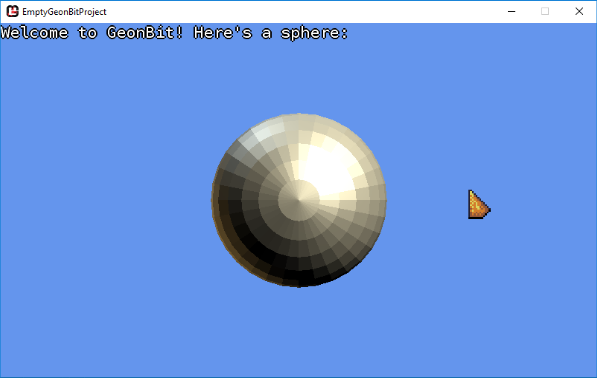
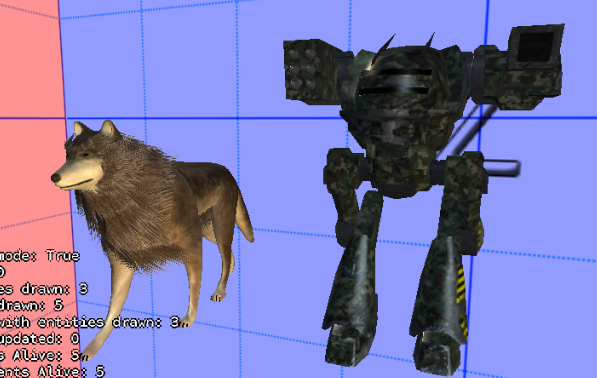

# GeonBit.Demos
Demo projects for the [GeonBit](http://geonbit.com) engine.

## EmptyGeonBitProject

Just an empty GeonBit project, created directly from the GeonBit template and unedited.

## SpaceshipGame

A simple 3D game with a spaceship that need to navigate between asteroids.

## Sprites

Illustrate the built-in sprite & billboard components, and how to use them.

## ParticleSystems

Show some CPU-based particle system examples.

## SkinnedMesh

Shows basic skinned animation.

## Octree

Shows the Octree scene node type and how it can optimize renderings.

## Isometric

Shows a trick to how to make Isometric-styled game.

## Lights

Demonstrate the built-in lit material.

## Physics

Demonstrate the built-in physics integration (using bullet3d).

## CombinedMeshes

Demonstrate the built-in combined meshes renderer, which allows us to draw lots of static meshes as one.

